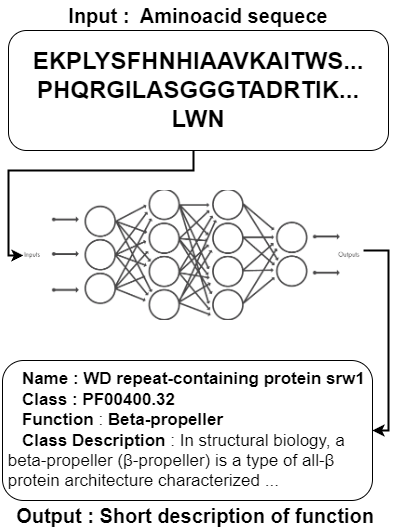
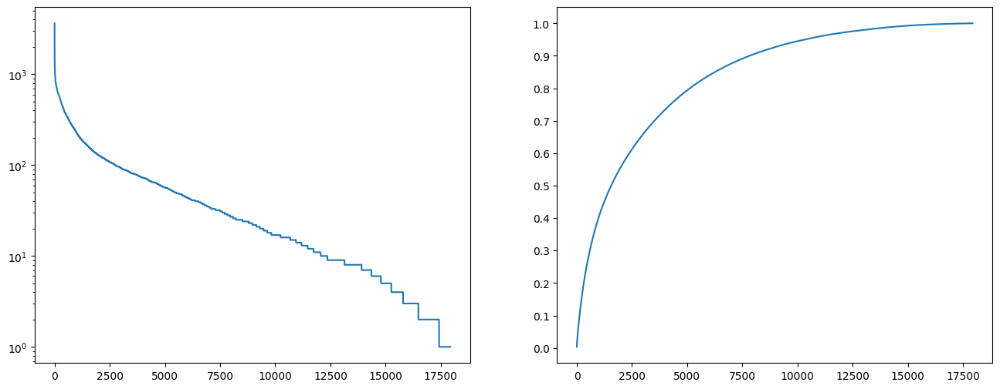
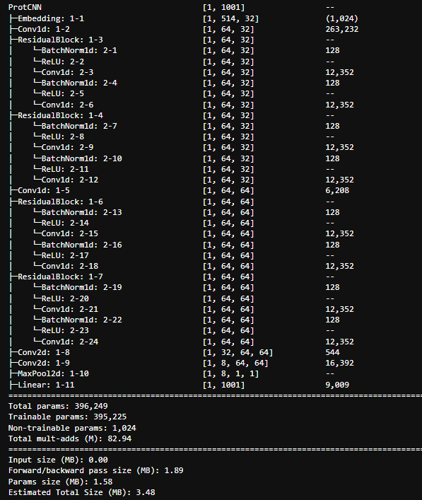
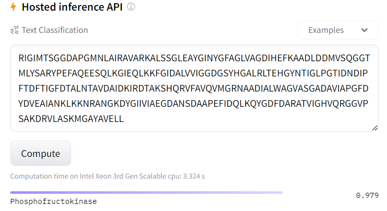

# PROTNAME

For more details about results and technical details please see the [report](report.pdf).

## Structure 
| folder  | description  |
|---|---|
| csf  | folder containing python script which ran the protCNN and other architectures on CSF with sample jobfile  |
| data  | folder where the data was stored. The dataset was large (>15 MB), therefore a link to google drive can be found in data section  |
| data-collection  | scripts/jupyter notebook that  handled interaction with the Uniprot and InterPro (for PFAM), that collected the data, processed it and saved it. For PFAM it also collected information such as description of families and names (whole metadata was saved)|
| models  | contains few small models for PFAM family classification (protCNN), all the other models are stored on hugging face and google drive because they are too large |
| notebooks  | Folder containing all the code for the project (only pure python script were run briefly on CSF) |

## CSF 
folder containing the "run_PROTCNN.py" and sample CSF jobfile. There seems to be a problem however with the CSF and tensorflow (we received strange errors) and it was never resolved by CSF team, therfore it was abandoned.

## data 
We collected roughly two datasets : one was from PFAM, containing a ~1.5mln pairs of sequences and PFAM families (labels that denote certain function) which was provided by researchers here [here](https://www.kaggle.com/datasets/googleai/pfam-seed-random-split), and we collected using web REST API data from UniProt and InterPro. 
folder containing all the data collected during the project (PFAM.zip and data collected from uniprot and InterPro). In this submission only processed (sequence length <= 510), manually reviewed proteins from human organism are provided. Rest of the files can be found :
|name| description|
|---|---|
|[human_proteins.tsv](https://drive.google.com/file/d/1yXvDTRRxjCLyAf4icU1sEMKF0NpssCnC/view?usp=share_link)|unfiltered, manually reviewed human proteins|
|[proteins_annot5.tsv](https://drive.google.com/file/d/1e1Tz4VycXhimx3ZyrxgL72VBaC0JP6By/view?usp=sharing)|all sequences/names that have UniProt annotation score = 5|
|[proteins_annot4.tsv](https://drive.google.com/file/d/12RLykiTtqapho81rGwEVMrQmMBdVEoQR/view?usp=sharing)|all sequences/names that have UniProt annotation score = 4|
|[proteins_dataset.tsv](https://drive.google.com/file/d/1FLrC9kK5-R_NwjmX_WTqT8YqchzS9zIN/view?usp=sharing)|filtered sequences/names that have UniProt annotation score at least 4|
|[pfam.zip](https://drive.google.com/file/d/1w3IQMK3PmXH-Bq6Lt_P8wxGPvr5olrZT/view?usp=sharing)|1.5mln of proteins with associated family ID which describes some properties of the sequence. This data has been taken from ["Using deep learning to annotate the protein universe"](https://www.nature.com/articles/s41587-021-01179-w) paper, and contains ready to use train/test/val split accessible [here](https://www.kaggle.com/datasets/googleai/pfam-seed-random-split) |

## Issues
- data imbalance : for PFAM dataset the data is very unbalanced, having a long tail distribution, which can be seen of figure [1]. This has been addressed by focusing on 1000 most common protein families, which we believed still represent good results (40% of whole data) and we did not have resources to train larger models.
 The 1000 most common proteins dataset is still inbalanced however, it's much better than the above figure (around 5000 clases have less than or equal 10 samples). This is simillar approach to protCNN and protTNN approaches (taking only the most popular classes).
- data reliability : PFAM dataset has been created by authors of the protCNN paper therefore we assumed the data was reliable. For Uniprot data, for training of T5 model we trained only on a small protion of human proteins that were annotated by human specialists (~20k). The T5 tokenizer for protein names has been trained on much larger protion (~700k proteins) that had an annotation score 4 or 5 (the best annotation score and almost the best). We believed that by that, we operate on well labeled data, that would form a good dataset for tokenizer and training. This could be much extended but it would require much more resources. For all the created models in pytorch/HF we used a validation split 0.8. 
- For language modelling we followed simillar approach, and focused on masking only 50 most common proteins (due to long time required for masking). 

# Solution 
|name of the model| how and were we used it|
|---|---|
|protCNN|convolutional based network that predicts the PFAM family ID that provides a description of the aminoacid sequence. It was inspired by protCNN paper and kaggle notebooks, however we don't know how much it matches the original architecture (code there was not provided). Trained in pytorch and keras, and the torch summary of basic,initial can be found below (we did multiple experiments of such architectures, changing the kernel sizes, number of residual blocks, all details can be found here in [notebooks/classification_pytorch.ipynb](notebooks/classification_pytorch.ipynb)). The models takes a sequence of max 512 aminoacids, and outputs a label that provides a description|
|BERT-tiny|A created with random weights in hugging face model, that represented tiny-BERT (number of layers=2, hidden_size=128). This model was pretrained on Masked Language Modelling (accuracy 48% on 5 most common proteins) of the aminoacids and used for classification of family ID's achieving > 95% accuracy. It is hosted on hugging face and can be found https://huggingface.co/mlewand/PROTBERT-tiny and here https://huggingface.co/mlewand/PROTBERT-small, and they can be easily reused or repurposed using hugging face transformers API. The models takes a sequence of max 512 aminoacids, and outputs a label that provides a description |
|BERT_LM-L8_hid512|It's BERT architecture however with 8 hidden layers, and hidden size of 512. Simillarly, it was pretrained on Masked Language modelling and achieved much lower loss on much larger dataset (~55% accuracy, on 40 most common proteins which was ~50k proteins). This model can be found here https://huggingface.co/mlewand/PROTBERT_LM-L8_hid512 and it can be easily reused or repurposed using hugging face transformers API. The model takes a masked input of aminoacid (we hide some of the aminoacid there), and outputs the reconstructed output (the probabilities of what the aminoacid should nr there)|
|small T5| a T5 (the t5-small version) network initialized from hugging face interface, which was used for protein name production. This model was trainined on small subset of proteins (human proteins annotated by experts, where we removed any other names except the standard/preferred name), can be found here https://huggingface.co/mlewand/PROT5-small and can be reused or repurposed using hugging face transformers API (however a an extra tokenizer from that repository needs to be loaded ). The model takes a sequence of max 512 aminoacids, and outputs a max of 32 tokens that represent a name.|

## protCNN
ProtCNN

# Evaluation 
For trained models we used the 80/10/10 train/val/test split. For the classification task, the accuracy and F1 score has been recorded (F1 score with "average" weighting option). For Masked Language modelling we report the accuracy/the percentage of the masked amnioacids that the model got right. The protein to name evaluation is difficult as it requires extensive knowledge about biology and sometimes about certain time/properties of the sequence, therefore we looked only for exact match.

# Live Demo
## Classification 
the models are hosted on hugging face. an example of interaction can be found here : 
https://huggingface.co/mlewand/PROTBERT-tiny?text=RIGIMTSGGDAPGMNLAIRAVARKALSSGLEAYGINYGFAGLVAGDIHEFKAADLDDMVSQGGTMLYSARYPEFAQEESQLKGIEQLKKFGIDALVVIGGDGSYHGALRLTEHGYNTIGLPGTIDNDIPFTDFTIGFDTALNTAVDAIDKIRDTAKSHQRVFAVQVMGRNAADIALWAGVASGADAVIAPGFDYDVEAIANKLKKNRANGKDYGIIVIAEGDANSDAAPEFIDQLKQYGDFDARATVIGHVQRGGVPSAKDRVLASKMGAYAVELL

An example of interaction in google colab can be found in this notebook [notebooks/classification_use.ipynb](notebooks/classification_use.ipynb)

## Masked Language Modelling 
The models are hosted on hugging face. an example of interaction can be found here :
https://huggingface.co/mlewand/PROTBERT_LM-L8_hid512?text=IIDIGCGDG%3Cmask%3ERTLANLPAESVGIDLSRTGLQLAADTVPSATLVQADMASLPVAENTADAITASHAVFHVPRSDHPTVYREVARVLKPGG
An example of interaction in google colab can be found in this notebook [notebooks/MLM_use.ipynb](notebooks/MLM_use.ipynb)

## Protein name prediction
due to some problems with tokenizer and how the model was trained, the hugging face interface doesn't work unfortunately. The model is however stored there, and it is possible to interact easily with it using hugging face transformers API, as described here. Whole evaluation (data loading) and model loading from hugging face can be found here [notebooks/T5_eval.ipynb](notebooks/T5_eval.ipynb)

# Overal Aim and Learning
- all the models we were planning to train (protCNN, some other simpler versions for evaluation, BERT and T5) has been trained. We had to downscale much ( especially in terms of data) because smaller versions of the models did not perform well on larger dataset within reasonable time and with our resources. The results we have achieved look satisfying right now, however there is huge room for improvement if given enough data, computational resources and time.

# noteboks 
|notebook| description|
|---|---|
|[notebooks/classification_use.ipynb](notebooks/classification_pytorch.ipynb) [notebooks/pfam.ipynb](notebooks/pfam.ipynb)|training, description of few architectures in pytorch / keras that predicts the PFAM family  (description of what the protein does)|
|[notebooks/HF_Bert_PFAM_classification.ipynb](notebooks/HF_Bert_PFAM_classification.ipynb) [notebooks/HF_PFAM_classification.ipynb](notebooks/PROTBERT_pfam_pretraining_larger.ipynb) [notebooks/PROTBERT_pfam_pretraining_larger.ipynb](notebooks/HF_PFAM_classification.ipynb)|training and getting the data of BERT models for classification, using Hugging Face|
|[notebooks/NLU_Masked_language_modelling_2.ipynb](notebooks/NLU_Masked_language_modelling_2.ipynb)|Masked Language Modelling using BERT|
|[notebooks/T5_for_name_2.ipynb](notebooks/T5_for_name_2.ipynb) All other notebooks with T5|Protein Name prediction using T5|